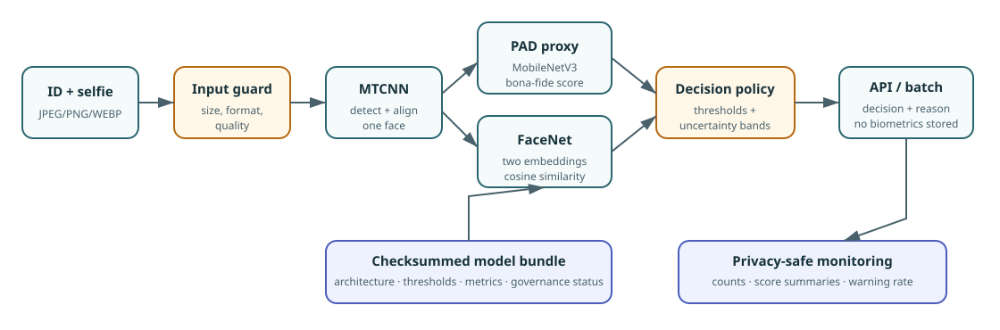

<div align="center">

# FaceKYC

### Hệ thống hỗ trợ đối chiếu khuôn mặt 1:1 và sàng lọc presentation attack cho quy trình eKYC

[](https://www.python.org/)
[](https://pytorch.org/)
[](https://fastapi.tiangolo.com/)
[](https://streamlit.io/)
[](#kiểm-thử-và-tái-lập)

FaceKYC kết hợp workflow Data Scientist đã khóa với pipeline Machine Learning
Engineering dùng chung cho API, batch inference và dashboard. Hệ thống kiểm tra chất
lượng ảnh, phát hiện khuôn mặt, chấm điểm passive PAD và tính cosine similarity trước
khi trả decision cùng reason code.

</div>

> **Phạm vi:** FaceKYC là tín hiệu hỗ trợ rà soát, không phải bằng chứng pháp lý về
> danh tính và không được dùng độc lập để tự động phê duyệt hoặc từ chối KYC. Bundle
> hiện tại là **research candidate**, chưa production-ready.

## Tổng quan kiến trúc



Ảnh ID và selfie đi qua cùng một pipeline raw-to-decision: input guard → quality
gate → MTCNN → MobileNetV3 passive PAD → FaceNet/VGGFace2 → policy decision. Model,
threshold và data protocol được đọc từ bundle có checksum; API và batch không tự tái
tạo preprocessing hoặc hard-code threshold riêng.

## Bài toán nghiệp vụ

FaceKYC hỗ trợ analyst xử lý một cặp ảnh đã được thu thập hợp lệ:

1. Kiểm tra format, kích thước, độ sáng và độ sắc nét.
2. Yêu cầu đúng một khuôn mặt với detection confidence đủ cao.
3. Sàng lọc selfie bằng passive PAD score.
4. So sánh embedding ảnh ID và selfie bằng cosine similarity.
5. Trả một trong bốn hành động: `verified`, `not_verified`, `manual_review` hoặc
   `recapture`, kèm reason code và model version.

`manual_review` và `recapture` không đồng nghĩa với gian lận. Passive PAD từ một ảnh
tĩnh không thay thế active challenge, NFC/chip verification, document authenticity,
device intelligence hoặc quy trình eKYC đầy đủ.

## Kết quả locked holdout

Face verification dùng FaceNet `InceptionResnetV1` pretrained trên VGGFace2. Model
được chọn trên LFW folds 0–7; threshold được khóa trên fold 8 theo target FMR 1%; fold
9 chỉ được mở đúng một lần trong notebook 05.

PAD proxy dùng MobileNetV3-Small với class contract `0 = attack`, `1 = bona_fide`.
Threshold được khóa trên validation subject-disjoint theo target APCER 5%. Attack là
biến đổi tổng hợp từ LFW, không phải mẫu print/replay/mask/deepfake thật.

| Stage | Validation | Locked holdout |
|---|---:|---:|
| Verification threshold | 0,422526 | 0,422526 |
| FMR | 1,0000% | 0,6667% |
| FNMR | 4,6667% | 3,6667% |
| Verification accuracy | 97,1667% | 97,8333% |
| Verification AUC | 0,993622 | 0,997411 |
| PAD threshold | 0,761909 | 0,761909 |
| APCER | 5,0000% | 5,7769% |
| BPCER | 0,0000% | 0,0996% |
| ACER | 2,5000% | 2,9382% |
| PAD accuracy | 97,5000% | 97,0618% |
| PAD AUC | 0,999081 | 0,998710 |

Verification holdout gồm 600 pairs; PAD proxy holdout gồm 2.008 ảnh. Cả bốn screening
gate FMR ≤ 2%, FNMR ≤ 20%, APCER ≤ 10% và BPCER ≤ 20% đều đạt. Nguồn máy đọc là
[`reports/ds/05_locked_holdout.json`](reports/ds/05_locked_holdout.json); metric README
được lấy trực tiếp từ report này, không tính lại hoặc làm tròn từ nguồn khác.

## Workflow Data Scientist

Các notebook đã được chạy thủ công theo thứ tự và lưu output thật:

1. [`01_Business_and_Data_Audit.ipynb`](notebooks/01_Business_and_Data_Audit.ipynb)
   — business framing, license, split và leakage audit.
2. [`02_Face_Detection_and_Quality.ipynb`](notebooks/02_Face_Detection_and_Quality.ipynb)
   — hành vi MTCNN và quality gate trên ảnh development.
3. [`03_Face_Verification_Experiments.ipynb`](notebooks/03_Face_Verification_Experiments.ipynb)
   — so sánh FaceNet backbone, threshold lock trên LFW fold 8.
4. [`04_Liveness_Detection_Experiments.ipynb`](notebooks/04_Liveness_Detection_Experiments.ipynb)
   — tạo PAD proxy subject-disjoint, chọn MobileNetV3-Small và xuất checkpoint.
5. [`05_Business_Report.ipynb`](notebooks/05_Business_Report.ipynb) — mở hai holdout
   đúng một lần, chạy screening gate và lập báo cáo cuối.

Không chạy lại notebook 05 chỉ để làm mới output. Một đánh giá holdout mới phải dùng
experiment/model version mới và có chính sách holdout được ghi nhận riêng. Xem thêm
[`notebooks/README.md`](notebooks/README.md).

## Workflow Machine Learning Engineer

Research bundle `artifacts/facekyc_bundle.json` được promote trực tiếp từ checkpoint
notebook 04 và report notebook 05, không fit lại model. Bundle schema `1.1` chứa:

- kiến trúc và pretrained dataset của FaceNet;
- MobileNetV3 class/score contract và input size;
- hai threshold đã khóa cùng metric/protocol nguồn;
- SHA-256 checkpoint và checksum toàn bundle;
- trạng thái deployment, screening gate, limitation và holdout access count.

Các thành phần triển khai:

- `src/facekyc/`: config, quality, model adapters, artifact, inference, batch và
  privacy-safe monitoring.
- `scripts/promote_artifact.py`: xác minh report/checkpoint rồi tạo bundle candidate;
  không có cờ tự phê duyệt production.
- `scripts/batch_verify.py`: nhận manifest ảnh thô có giới hạn số dòng, ghi JSONL
  không chứa ảnh, embedding hoặc path ảnh.
- `scripts/monitor_results.py`: tổng hợp decision, reason code, score và warning rate.
- `backend/`: FastAPI với `/live`, `/ready`, `/health`, `/model` và
  `/api/v1/verify`.
- `frontend/`: Streamlit review console cho analyst, hiển thị model governance và
  hướng dẫn hành động.
- `docker-compose.yml`: tách API/frontend; model artifact được mount read-only.

Serving mặc định fail-closed nếu thiếu artifact, checksum sai hoặc bundle chưa
`approved`. Research candidate chỉ chạy khi operator bật
`FACEKYC_ALLOW_CANDIDATE=true`; response và dashboard vẫn hiển thị `candidate`.

## Cấu trúc dự án

```text
configs/                 Source of truth cho input, policy và monitoring
notebooks/               Workflow Data Scientist đã thực thi
reports/ds/              Locked evidence tổng hợp, không chứa biometrics
artifacts/               Checkpoint/bundle local; model binary không commit Git
src/facekyc/             Pipeline raw-to-decision và logic MLE dùng chung
scripts/                 CLI validate, train, evaluate, promote, batch, monitor
backend/                 FastAPI serving
frontend/                Streamlit analyst review console
tests/                   Unit test và integration test không tải model
docs/assets/             Architecture asset dùng trong tài liệu
.github/workflows/       CI lint, test, notebook audit và Docker build
```

## Cài đặt

Yêu cầu Python 3.11 đến 3.13:

```powershell
python -m venv .venv
.venv\Scripts\python.exe -m pip install -e ".[dev,api,frontend]"
.venv\Scripts\python.exe -m pip install -e ".[vision]"
```

Checkpoint `artifacts/pad_proxy_selected.pt` phải có SHA-256:

```text
490a9c962d6b2262895a739a9507a000850fe6771c46cb01f54d0b99cb03d492
```

Tạo research bundle từ evidence đã khóa:

```powershell
.venv\Scripts\python.exe scripts\promote_artifact.py `
  --model-version facekyc-research-2026-08-31
```

## Quick start serving

Chạy API research candidate:

```powershell
$env:FACEKYC_ALLOW_CANDIDATE = "true"
.venv\Scripts\python.exe -m uvicorn backend.main:app `
  --host 127.0.0.1 --port 8004
```

Chạy dashboard ở terminal thứ hai:

```powershell
$env:FACEKYC_API_URL = "http://127.0.0.1:8004"
.venv\Scripts\python.exe -m streamlit run frontend\app.py `
  --server.port 8504
```

- API docs: `http://127.0.0.1:8004/docs`
- Dashboard: `http://127.0.0.1:8504`
- Readiness: `http://127.0.0.1:8004/ready`

Production không đặt `FACEKYC_ALLOW_CANDIDATE`; service sẽ trả `503 not_ready` cho
đến khi có bundle được phê duyệt độc lập.

## Batch inference và monitoring

Manifest dùng đường dẫn tương đối so với file CSV:

```csv
record_id,id_image,selfie_image
case-001,inputs/case-001-id.jpg,inputs/case-001-selfie.jpg
```

```powershell
.venv\Scripts\python.exe scripts\batch_verify.py `
  --manifest manifest.csv `
  --output outputs\results.jsonl `
  --allow-candidate

.venv\Scripts\python.exe scripts\monitor_results.py `
  --input outputs\results.jsonl `
  --output reports\monitoring.json
```

`--allow-candidate` chỉ dành cho đánh giá local. Batch trả exit code `2` nếu có record
không xử lý được; monitoring đánh dấu `insufficient_data` nếu chưa đạt minimum batch
size cấu hình.

## Kiểm thử và tái lập

```powershell
.venv\Scripts\python.exe -m pytest
.venv\Scripts\ruff.exe check src backend frontend scripts tests --no-cache
.venv\Scripts\python.exe scripts\audit_notebooks.py --structure-only
.venv\Scripts\python.exe -m pip check
docker compose config --quiet
```

Trạng thái kiểm tra gần nhất:

- 32 test unit/integration đã qua; bao phủ metric semantics, quality gate, artifact
  tampering, candidate serving gate, uncertainty, API input limits, batch và monitoring.
- 5 notebook đúng nbformat, không có saved error output.
- Checkpoint và bundle checksum đã được xác minh khi load thật.
- API đã khởi tạo MTCNN, FaceNet/VGGFace2 và PAD checkpoint thành công; `/live`,
  `/ready`, `/model` trả đúng version/status/threshold.
- Request multipart ảnh tổng hợp qua HTTP trả `200 recapture` với reason code
  `face_not_detected`, request ID nhất quán và `Cache-Control: no-store`.
- Streamlit AppTest chạy không exception, kết nối API thành công, hiển thị đúng research
  warning và đủ ba tab nghiệp vụ.
- `pip check` sạch; config, report, Compose và CI YAML parse thành công.
- Docker CLI không có trong máy kiểm thử hiện tại nên image/Compose chưa được chạy local;
  CI được cấu hình build cả API và frontend.

Smoke test ảnh tổng hợp chỉ xác minh integration contract và nhánh `recapture`; nó
không thay thế end-to-end validation trên cặp ảnh ID/selfie đại diện.

## Quản trị và giới hạn

- LFW là benchmark khuôn mặt celebrity, không đại diện cho ảnh giấy tờ/selfie Việt Nam.
- PAD dùng attack tổng hợp từ LFW; metric không chứng minh khả năng chống print,
  replay, mask, camera injection hoặc deepfake thật.
- Chưa có subgroup fairness audit đại diện hoặc đánh giá theo ISO/IEC 30107-3.
- Không ghi log ảnh, embedding hoặc multipart payload. Monitoring chỉ dùng aggregate
  score, warning, decision và reason code.
- Trước production cần target-domain verification, PAD benchmark thật theo attack
  taxonomy, security test, rate limit/auth ở gateway, retention policy, human appeal
  process và phê duyệt risk/compliance độc lập.
- Không commit ảnh sinh trắc học, manifest chứa PII, `.env`, model weights hoặc output
  riêng tư vào Git.
  